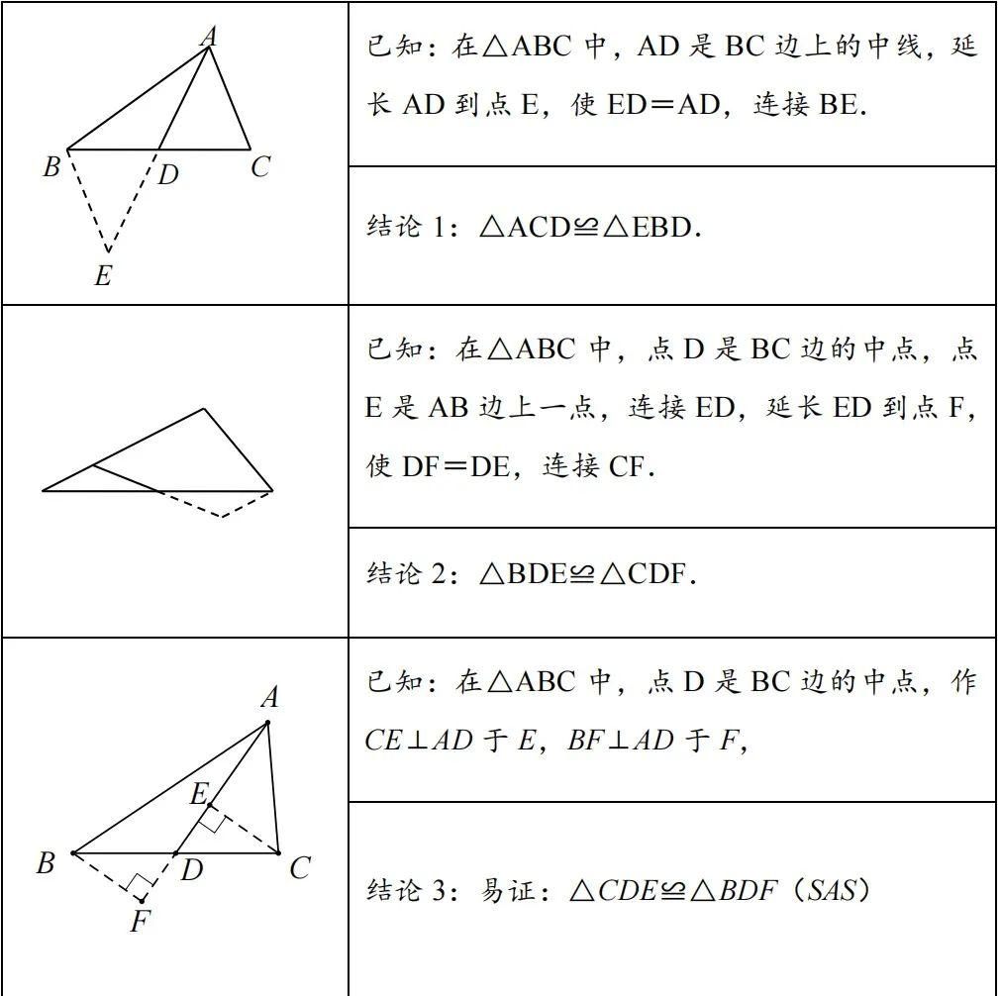
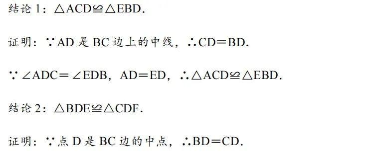
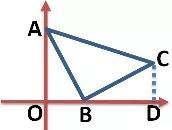
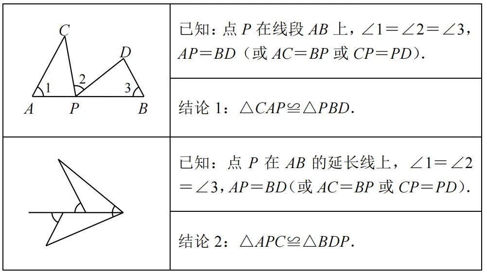
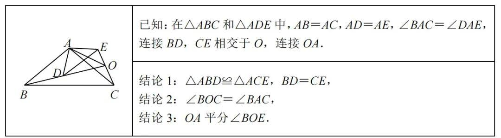
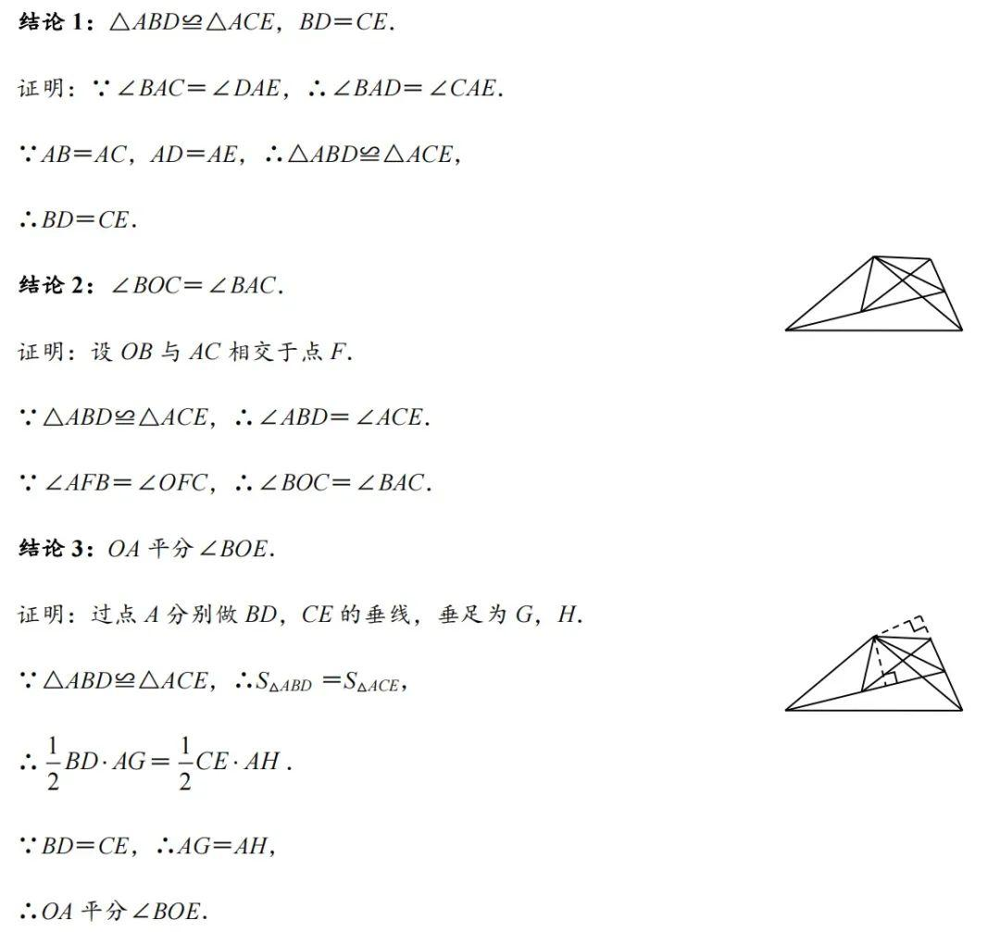

# 全等三角形模型

## 全等三角形的条件

1 SSS
三条边相等

2 SAS
2条边以及夹角相等

3 ASA 和 AAS
两个角以及夹边相等

4 AAS
两个角和非夹边的边相等

已知 ∠A = ∠A'，∠B = ∠B'，且 BC = B'C'（BC是∠A的对边）。
因为三角形内角和为180°，所以 ∠C = 180° - ∠A - ∠B = 180° - ∠A' - ∠B' = ∠C'。
此时，你有了 ∠B = ∠B'，∠C = ∠C'，且 BC（∠B与∠C的夹边）= B'C'。
这就转化为了 ASA 的条件，所以两三角形全等。

5 HL
直角三角形的一条直角边和斜边相等。

已知 Rt△ABC 和 Rt△A'B'C' 中，∠C = ∠C' = 90°，斜边 AB = A'B'，直角边 AC = A'C'。
根据勾股定理，另一条直角边 BC² = AB² - AC² = A'B'² - A'C'² = B'C'²，所以 BC = B'C'。
此时，三边（AB、AC、BC）分别对应相等，这就转化为了 SSS 的条件，所以两直角三角形全等。

## 全等模型

### 1. 倍长中线模型

#### 条件
- 中线/中点，构造 边相等。
- 延长，构造另外的变相等。
- 顶角，构造角相等。

#### 结论推导

#### 解题技巧
遇到中点或中线，则考虑使用“倍长中线模型”，即延长中线，使所延长部分与中线相等，然后连接相应的顶点，构造出全等三角形．

### 2. K字型

初二学完坐标系之后，会发现这个模型会经常出现。如下图，△ABC是一个等腰直角三角形，A在y轴上，顶点B在x轴上，过C作x轴的垂线后可以发现这就是一个K字型的三垂直全等模型，△ABO≌△BCD。

$ ASA => \triangle AOB \cong \triangle BDC$

### 3.一线三等线模型

#### 结论推导

结论1：△CAP≌△PBD．

证明：
∵∠1＋∠C＋∠APC＝180°，∠2＋∠BPD＋∠APC＝180°，∠1＝∠2，
∴∠C＝∠BPD．

∵∠1＝∠3，AP＝BD（或AC＝BP或CP＝PD），
∴△CAP≌△PBD．

结论2：△APC≌△BDP．

证明：
∵∠1＝∠C＋∠APC，∠2＝∠BPD＋∠D，∠3＝∠BPD＋∠APC，∠1＝∠2＝∠3，

∴∠C＝∠BPD，∠APC＝∠D．∵AP＝BD（或AC＝BP或CP＝PD），
∴△APC≌△BDP．

### 4. 手拉手模型

