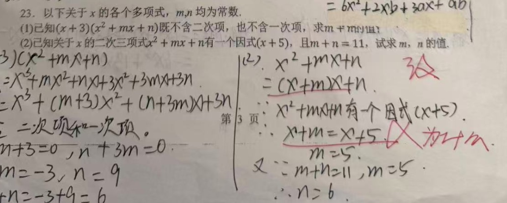
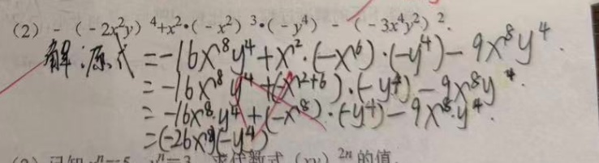
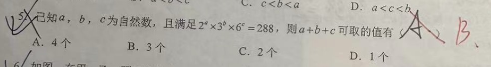
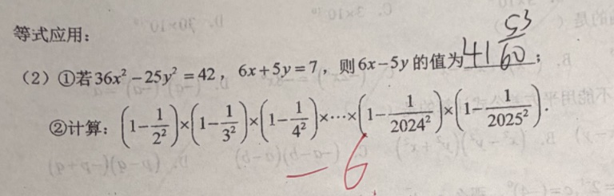
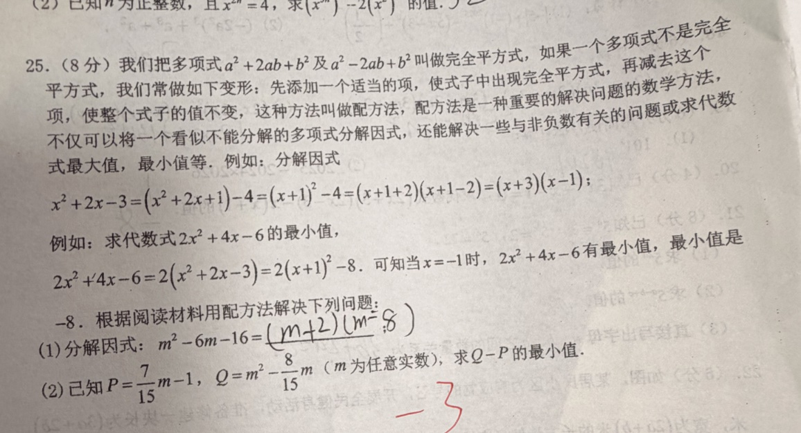
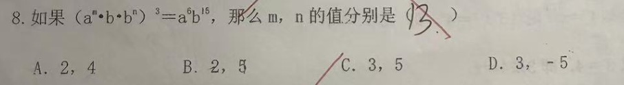
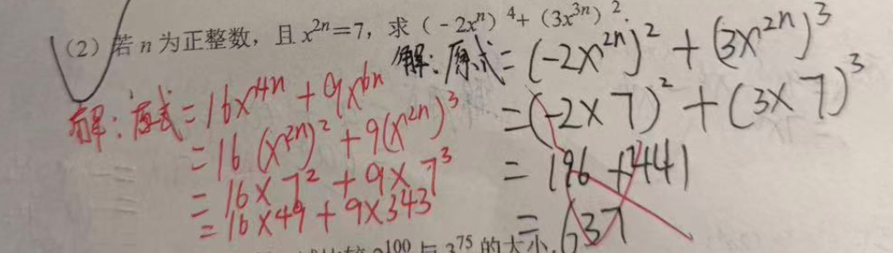

# 初一数学错题

## 因式分解

1. $己知关于x的二次三项式x^2+mx+n有一个因式(x+5)，且m+n=11，试求m，n 的值$

$$
\begin{align*}
& (x + a) (x + b) \\
& = x^2 + (a + b)x + ab \\
& \because (x + 5) \\
& \therefore = x^2 + (5 + b)x + 5b \\
& \therefore m = 5 + b, n = 5b \\
& \because m + n = 11 \\
& \therefore m + n = 5 + b + 5b = 11 \\
& => 5 + 6b = 11 \\
& => b = 1 \\
& \therefore m = 5 + b = 6; n = 5b = 5
\end{align*}
$$

2. 题目:$-(-2x^2y)^4 + x^2(-x^2)^3\cdot(-y^4) - (-3x^4y^2)^2$

$$
\begin{align*}
    解:& -(-2x^2y)^4 + x^2(-x^2)^3\cdot(-y^4) - (-3x^4y^2)^2 \\
    & => -16x^8y^4 + x^2\cdot x^6 \cdot y^4 - 9x^8y^4 \\
    & => -16x^8y^4 + x^8y^4 - 9x^8y^4 \\
    & => -24x^8y^4
\end{align*}
$$

3. $已知a，b，c为自然数，且满是2^a3^b6^c = 288，则a+b+c可取的值有$

$$
288 = 3 \cdot 3 \cdot 2^5 = 3^2 \cdot 2^5 \\
2^a3^b6^c = 2^a \cdot 3^b \cdot (2 \cdot 3)^c \\
= 2^{(a + c)} 3^{(b +c)} \\ => b + c = 2, a + c = 5 \\
\therefore b = 1, c = 1 => a = 4 or \\
b = 0 c = 2, a = 3 or \\
b = 2 c = 0, a = 5 
$$

4. $若x^2+ax+100是一个完全平方式，则常数a的值为$

$$
\begin{align*}
    & \because x^2+ax+100 = (x + b)^2 \\
    & \therefore x^2 + 2bx + b^2 = x^2 + ax + 100 \\
    & b = 10, a = 2b = 20
\end{align*}
$$

5. $已知x^2-3x+1=0, 则下面正确的是：$

A, $x + \frac{1}{x} = 3$ 

B, $x^2+\frac{1}{x^2} = 7$

C, $(x - \frac{1}{x})^2 = 5$

D, $2x^3 -16x + 3 = -2$

$$
\begin{align*}
    & x^2 - 3x + 1 = (x - \frac{3}{2})^2 - \frac{5}{4} = 0
\end{align*}
$$

1.
$$
\begin{align*}
    & 36x^2 - 25y^2 = 42 \\
    & (6x - 5y)(6x + 5y) = 42 \\
    & \because 6x + 5y = 7 \\
    & (6x - 5y) \times 7 = 42 \\
    & 6x - 5y = 6
\end{align*}
$$

2.
$$
\begin{align*}
    & (1 - \frac{1}{2^2}) \times (1 - \frac{1}{3^2}) \times ... \times (1 - \frac{1}{2024^2}) \times (1 - \frac{1}{2025^2}) \\
    & = \cfrac{2^2 - 1}{2^2} \times \cfrac{3^2 - 1}{3^2} \times ... \times \cfrac{2024^2 - 1}{2024^2} \times \cfrac{2025^2 - 1}{2025} \\ 
    & = \cfrac{(2 - 1)(2 + 1)}{2^2} \times \cfrac{(3 - 1)(3 + 1)}{ 3^2} \times ... \times \cfrac{(2024 - 1)(2024 + 1)}{2024^2} \times \cfrac{(2025 - 1)(2025 + 1)}{2025^2} \\
    & = \cfrac{1 \times 2026}{2 \times 2025} \\
    & = \cfrac{1023}{2025}
\end{align*}
$$

$$
\begin{align*}
    & P = \frac{7}{15}m - 1, Q = m^2 - \frac{8}{15}m \\
    & Q - P = m^2 - \frac{8}{15}m - (\frac{7}{15}m -1) \\
    & = m^2 -m + 1 \\
    & = (m - \frac{1}{2})^2 + \frac{3}{4} \\
    & \therefore m - \frac{1}{2} = 0 时 Q - P 最小 \\
    & 此时 m = \frac{1}{2}
\end{align*}
$$

## 次幂

- $如果(a^m\times b \times b^n)^3 = a^6b^{15}, 那么m,n的值?$

$$
\begin{align*}
    & (a^m\times b \times b^n)^3 = a^6b^{15} \\
    & => (a^m \times b^{1 + n})^3 = a^6b^{15} \\
    & => a^{3m}b^{3\times(1 +n)} = a^6b^{15} \\
    & \therefore 3m = 6; 3 \times (1 +n) = 15 \\
    & \therefore m = 2; n = 4;
\end{align*}
$$

- $(2)若n为正整数，且x^{2n}=7，求(-2x^n)^4+(3x^{3n})^2$

$$
\begin{align*}
    解 & (-2x^n)^4+(3x^{3n})^2 \\
    & = ((-2x^n)^2)^2 + 9x^{6n} \\
    & = (4x^{2n})^2 + 9\cdot (x^{2n})^3 \\
    & = 16 \times 7^2  + 9 \times 7^3 \\
    & = 49 \times (16 + 63) \\
    & = 49 * 89
\end{align*}
$$

- $.若x=3^m+2,y=9^m-8, 用x的代数式表示y,则y=?$

$$
\begin{align*}
    & y=9^m-8 \\
    & = (3^m)^2 - 8 \\
    & \because x = 3^m + 2 \\
    & => 3^m = x - 2 \\
    & \therefore y = (x - 2)^2 - 8 \\
    & => x^2 -4x -4
\end{align*}
$$

- 求 $(0.25)^{2023} \times (-4)^{2024}$

$$
\begin{align*}
    & (0.25)^{2023} \times (-4)^{2024} \\
    & = (\frac{1}{4})^{2023} \times (4)^{2024} \\
    & = (4)^{-2023} \times (4)^{2024}
    & = (4)^{-2023 + 2024} = 4^1 = 4
\end{align*}
$$

## 按照规律推算

- $在数学中，为了书写简便，18世纪数学家欧拉就引进了“求和”符号“\sum”。例如:记 \\
\sum_{k=1}^{n}{(K)} = 1 + 2 ... + n,  \\ \sum_{k=3}^{n}{x+k} = (x + 3) + ... + (x + n). \\ 已知 \sum_{2}^{n}{[(x + k)(x -k)]} = 4x^2 + m. 求 m 的值
$

$$
\begin{align*}
    & \sum_{2}^{n}{[(x + k)(x -k)]} \\
    & = (x + 2) (x - 2) + ... + (x + n)(x -n) \\
    & \because = 4x^2 + m \\
    & \therefore = (x + 2)(x -2) + (x + 3)(x -3) + (x + 4)(x -4) + (x + 5)(x -5) \\
    & = x^2 - 4 + x^2 - 9 + x^2 - 16 + x^2 - 25 \\
    & = 4x^2 - (4 + 9 + 16 + 25)

\end{align*}
$$

$$
\begin{align*}
    & a^3 + b^3 = ? \\
    & (a + b)^3 \\
    & = a^3 + 3a^2b + 3b^2a + b^3 \\
    & \because a + b = 5 \\
    & \therefore (a + b)^3 = 125 \\
    & a^3 + b^3 = (a + b)^3 - (2a^2b + 2b^2a) \\
    & = 125 - (2 \cdot ab \cdot a + 2 \cdot ab \cdot b) \\
    & \because ab = 2 \\
    & \therefore = 125 - (6a + 6b) = 125 - 6(a +b)\\
    & = 125 - 6 \times 5 \\
    & = 95 \\

 & (a + b)^3 \\
 & = (a + b)^2 \cdot (a + b) \\
 & = (a ^2 + b^2 + 2ab) (a + b) \\
 & = a^3 + ab^2 + 2a^2b + ba^2 + b^3 + 2ab^2 \\
 & = a^3 + b^3 + 3ab^2 + 3a^2b

\end{align*}
$$