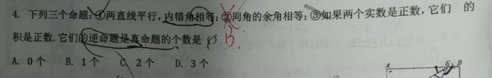
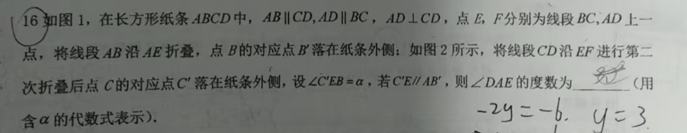
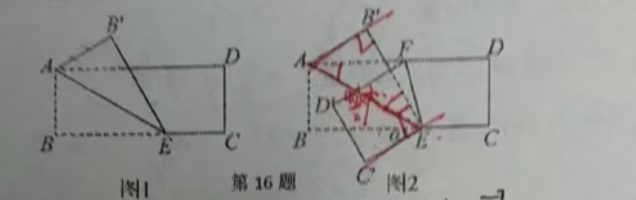
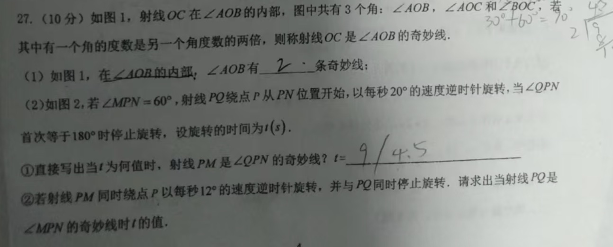
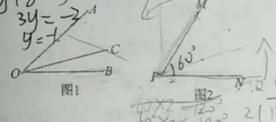
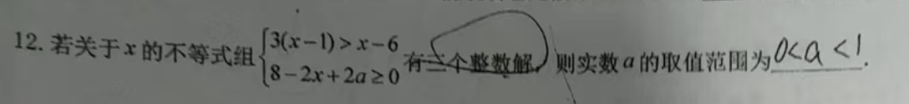
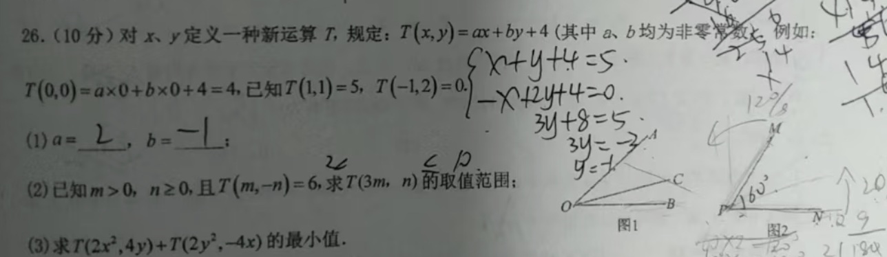
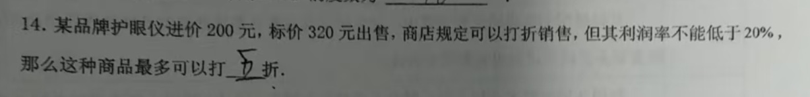
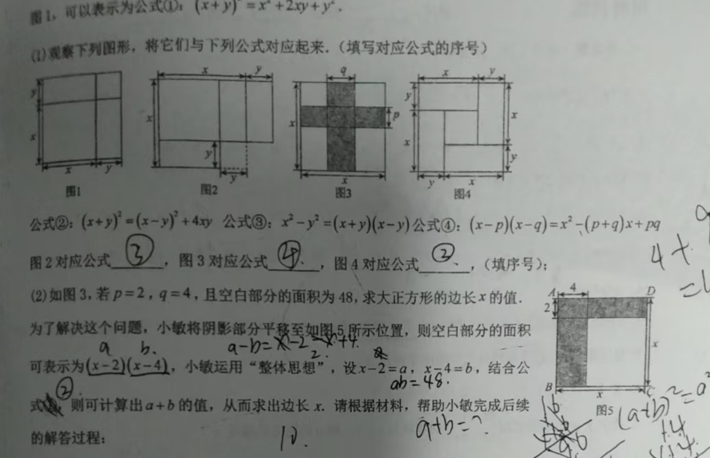

# 初一数学错题

[TOC]

## 因式分解

1. $己知关于x的二次三项式x^2+mx+n有一个因式(x+5)，且m+n=11，试求m，n 的值$

$$
\begin{align*}
& (x + a) (x + b) \\
& = x^2 + (a + b)x + ab \\
& \because (x + 5) \\
& \therefore = x^2 + (5 + b)x + 5b \\
& \therefore m = 5 + b, n = 5b \\
& \because m + n = 11 \\
& \therefore m + n = 5 + b + 5b = 11 \\
& => 5 + 6b = 11 \\
& => b = 1 \\
& \therefore m = 5 + b = 6; n = 5b = 5
\end{align*}
$$

2. 题目:$-(-2x^2y)^4 + x^2(-x^2)^3\cdot(-y^4) - (-3x^4y^2)^2$

$$
\begin{align*}
    解:& -(-2x^2y)^4 + x^2(-x^2)^3\cdot(-y^4) - (-3x^4y^2)^2 \\
    & => -16x^8y^4 + x^2\cdot x^6 \cdot y^4 - 9x^8y^4 \\
    & => -16x^8y^4 + x^8y^4 - 9x^8y^4 \\
    & => -24x^8y^4
\end{align*}
$$

3. $已知a，b，c为自然数，且满是2^a3^b6^c = 288，则a+b+c可取的值有$

$$
288 = 3 \cdot 3 \cdot 2^5 = 3^2 \cdot 2^5 \\
2^a3^b6^c = 2^a \cdot 3^b \cdot (2 \cdot 3)^c \\
= 2^{(a + c)} 3^{(b +c)} \\ => b + c = 2, a + c = 5 \\
\therefore b = 1, c = 1 => a = 4 or \\
b = 0 c = 2, a = 3 or \\
b = 2 c = 0, a = 5 
$$

4. $若x^2+ax+100是一个完全平方式，则常数a的值为$

$$
\begin{align*}
    & \because x^2+ax+100 = (x + b)^2 \\
    & \therefore x^2 + 2bx + b^2 = x^2 + ax + 100 \\
    & b = 10, a = 2b = 20
\end{align*}
$$

5. $已知x^2-3x+1=0, 则下面正确的是：$

A, $x + \frac{1}{x} = 3$ 

B, $x^2+\frac{1}{x^2} = 7$

C, $(x - \frac{1}{x})^2 = 5$

D, $2x^3 -16x + 3 = -2$

$$
\begin{align*}
    & x^2 - 3x + 1 = (x - \frac{3}{2})^2 - \frac{5}{4} = 0
\end{align*}
$$

1.
$$
\begin{align*}
    & 36x^2 - 25y^2 = 42 \\
    & (6x - 5y)(6x + 5y) = 42 \\
    & \because 6x + 5y = 7 \\
    & (6x - 5y) \times 7 = 42 \\
    & 6x - 5y = 6
\end{align*}
$$

2.
$$
\begin{align*}
    & (1 - \frac{1}{2^2}) \times (1 - \frac{1}{3^2}) \times ... \times (1 - \frac{1}{2024^2}) \times (1 - \frac{1}{2025^2}) \\
    & = \cfrac{2^2 - 1}{2^2} \times \cfrac{3^2 - 1}{3^2} \times ... \times \cfrac{2024^2 - 1}{2024^2} \times \cfrac{2025^2 - 1}{2025} \\ 
    & = \cfrac{(2 - 1)(2 + 1)}{2^2} \times \cfrac{(3 - 1)(3 + 1)}{ 3^2} \times ... \times \cfrac{(2024 - 1)(2024 + 1)}{2024^2} \times \cfrac{(2025 - 1)(2025 + 1)}{2025^2} \\
    & = \cfrac{1 \times 2026}{2 \times 2025} \\
    & = \cfrac{1023}{2025}
\end{align*}
$$

$$
\begin{align*}
    & P = \frac{7}{15}m - 1, Q = m^2 - \frac{8}{15}m \\
    & Q - P = m^2 - \frac{8}{15}m - (\frac{7}{15}m -1) \\
    & = m^2 -m + 1 \\
    & = (m - \frac{1}{2})^2 + \frac{3}{4} \\
    & \therefore m - \frac{1}{2} = 0 时 Q - P 最小 \\
    & 此时 m = \frac{1}{2}
\end{align*}
$$

## 次幂

### 公式

-------
$$
\begin{array}{l}
  a^{n} \cdot a^{m} = a^{n + m} \qquad (1) \\
  (a^{n})^{m} = a^{n\cdot m} \qquad (2) \\
  (\frac{1}{a})^n = a^{-n} \qquad (3) \\

  由(1)和(3) => \frac{a^n}{a^m} = a^{n - m}
\end{array} \\
$$

-------

- $如果(a^m\times b \times b^n)^3 = a^6b^{15}, 那么m,n的值?$

$$
\begin{align*}
    & (a^m\times b \times b^n)^3 = a^6b^{15} \\
    & => (a^m \times b^{1 + n})^3 = a^6b^{15} \\
    & => a^{3m}b^{3\times(1 +n)} = a^6b^{15} \\
    & \therefore 3m = 6; 3 \times (1 +n) = 15 \\
    & \therefore m = 2; n = 4;
\end{align*}
$$

- $(2)若n为正整数，且x^{2n}=7，求(-2x^n)^4+(3x^{3n})^2$

$$
\begin{align*}
    解 & (-2x^n)^4+(3x^{3n})^2 \\
    & = ((-2x^n)^2)^2 + 9x^{6n} \\
    & = (4x^{2n})^2 + 9\cdot (x^{2n})^3 \\
    & = 16 \times 7^2  + 9 \times 7^3 \\
    & = 49 \times (16 + 63) \\
    & = 49 * 89
\end{align*}
$$

- $.若x=3^m+2,y=9^m-8, 用x的代数式表示y,则y=?$

$$
\begin{align*}
    & y=9^m-8 \\
    & = (3^m)^2 - 8 \\
    & \because x = 3^m + 2 \\
    & => 3^m = x - 2 \\
    & \therefore y = (x - 2)^2 - 8 \\
    & => x^2 -4x -4
\end{align*}
$$

- 求 $(0.25)^{2023} \times (-4)^{2024}$

$$
\begin{align*}
    & (0.25)^{2023} \times (-4)^{2024} \\
    & = (\frac{1}{4})^{2023} \times (4)^{2024} \\
    & = (4)^{-2023} \times (4)^{2024}
    & = (4)^{-2023 + 2024} = 4^1 = 4
\end{align*}
$$

- 求 $(-0.25)^{2023} \times (-4)^{2024}$

$$
\begin{align*}
    & (-0.25)^{2023} \times (-4)^{2024} \\
    & = -(\frac{1}{4})^{2023} \times (4)^{2024} \\
    & = - (4)^{-2023} \times (4)^{2024}
    & = (4)^{-2023 + 2024} = -4^1 = -4
\end{align*}
$$

### 错题1

$$
\begin{array}{l}
    (a^{m+1}b^{n+2})(a^{2n-1}b^{2n}) = a^5b^3 \\
    => a^{m+1} \cdot b^{n+2} \cdot a^{2n-1} \cdot b^{2n} = a^5b^3 \\
    => a^{m+1}\cdot a^{2n-1} \cdot b^{n+2} \cdot b^{2n} = a^5b^3 \\
    => a^{m + 1 + 2n - 1} \cdot b^{n+ 2 + 2n} = a^5b^3 \\
    => a^{m + 2n} \cdot b^{3n + 2} = a^5b^3 \\
    => \begin{cases}
        m + 2n = 5 \qquad (1) \\
        3n +2 = 3  \qquad (2)
    \end{cases} \\
    => n = \frac{1}{3}, m = (5 - \frac{2}{3}) \\
    => m + n = 5 -\frac{2}{3} + \frac{1}{3} = 5 - \frac{1}{3}
\end{array}
$$

### 错题2

$$
\begin{array}{l}
  设行数n，则a_i 和n的关系为 n = \frac{i}{2} + 1 \\
  如 \frac{i}{2}余数为0,则 a_i = 2^n, 如果 \frac{i}{2} 余数为1，则 a_i = 2^n - 1 \\
  所以 a_{2024} = 2^{\frac{2024}{2} + 1} = 2^{1012 + 1} \\
  a_{2025} = 2^{1012 + 1} - 1 \\
  a_{2024} + a_{2025} = 2^{1013} + 2^{1013} - 1 \\
  = 2 \cdot 2^{1013} - 1\\
  = 2^{1013 + 1} - 1 = 2^{1014} - 1
\end{array}
$$

## 按照规律推算

- $在数学中，为了书写简便，18世纪数学家欧拉就引进了“求和”符号“\sum”。例如:记 \\
\sum_{k=1}^{n}{(K)} = 1 + 2 ... + n,  \\ \sum_{k=3}^{n}{x+k} = (x + 3) + ... + (x + n). \\ 已知 \sum_{2}^{n}{[(x + k)(x -k)]} = 4x^2 + m. 求 m 的值
$

$$
\begin{align*}
    & \sum_{2}^{n}{[(x + k)(x -k)]} \\
    & = (x + 2) (x - 2) + ... + (x + n)(x -n) \\
    & \because = 4x^2 + m \\
    & \therefore = (x + 2)(x -2) + (x + 3)(x -3) + (x + 4)(x -4) + (x + 5)(x -5) \\
    & = x^2 - 4 + x^2 - 9 + x^2 - 16 + x^2 - 25 \\
    & = 4x^2 - (4 + 9 + 16 + 25)

\end{align*}
$$

$$
\begin{align*}
    & a^3 + b^3 = ? \\
    & (a + b)^3 \\
    & = a^3 + 3a^2b + 3b^2a + b^3 \\
    & \because a + b = 5 \\
    & \therefore (a + b)^3 = 125 \\
    & a^3 + b^3 = (a + b)^3 - (2a^2b + 2b^2a) \\
    & = 125 - (2 \cdot ab \cdot a + 2 \cdot ab \cdot b) \\
    & \because ab = 2 \\
    & \therefore = 125 - (6a + 6b) = 125 - 6(a +b)\\
    & = 125 - 6 \times 5 \\
    & = 95 \\

 & (a + b)^3 \\
 & = (a + b)^2 \cdot (a + b) \\
 & = (a ^2 + b^2 + 2ab) (a + b) \\
 & = a^3 + ab^2 + 2a^2b + ba^2 + b^3 + 2ab^2 \\
 & = a^3 + b^3 + 3ab^2 + 3a^2b

\end{align*}
$$

## 完全平方公式

### 平方差公式

**$x^2 - y^2 = (x + y)(x - y)$**

#### 构造平方差
1. $若x^2-y^2=4052,x+y=2，则x-y= ??$

### 完全平方公式

1. **$(x - y)^2 = x^2 - 2xy + y^2$**
2. **$(x + y)^2 = x^2 + 2xy + y^2$**

#### 构造完全平方 - 配方法

1. 

$$
\begin{align*}
    & 配方法的实质是构造完全平方公式。\\
    & 首先忽略常数项，构造完全平方。\\
    &  如图，解第二问:
    \\ \\
    M &  = a^2 + b^2 - 2a + 4b + 10 \\
    & = a^2 - 2a + b^2 + 4b + 10 \\
    & = (a - 1)^2 - 1 + (b + 2)^2 - 4 + 10 \\
    & = (a - 1)^2 + (b + 2)^2 + 5 \\
    & \because (a - 1)^2 + (b + 2)^2 \ge 0 \\
    & \therefore M \ge 5 \\
\end{align*}

$$

## 角

- 同角，相同的一个角。
- 等角，相等的角。
- 余角，指两个角的合为$90^\circ$

### 错题1

同角是指同一个角，而等角是指大小相等的角。命题“余角相等则是同角”是错误的，因为如果两个角的余角相等，只能推出这两个角相等（即等角）

### 旋转问题

#### 06.11

##### 错题1.

 

$$
\begin{array}{l}
    \because AD \parallel BC \\
    \therefore \angle DAE = \angle BEA \\
    \because AB' \parallel C'E \\
    \therefore \angle B'AE = \angle C'EA \\
    又 \because B'AE = \angle BAE (折叠角) \\
    \therefore \angle C'EA = \angle BAE  \qquad(1)\\
    \angle BEA = 90 - \angle BAE  \qquad (2)\\
     \angle BEA = \angle C'EA - a \\
      => \angle C'EA =  \angle BEA + a \qquad (3) \\
      由 (1) (2) \\
    => \angle BEA = 90 - (\angle BEA + a) \\
    => \angle BEA = \frac{90 - a}{2} = \angle DAE

\end{array}
$$

##### 错题2.

 

$$
\begin{array}{l}
    \angle QPN = 20t \\
    1) \quad 当 \angle QPM = \frac{1}{2} \angle MPN 时 \\
    PM 为 \angle QPN的奇妙线 \\
    此时 \angle QPN = 20 t = \angle QPM + \angle MPN \\
    => 20t = \frac{1}{2} \angle MPN  + \angle MPN  \\
    => t = \frac{9}{2} \\
    2) \quad 或者 \angle QPM = 2 \angle MPN 时 \\
    PM 为 \angle QPN的奇妙线 \\
    => 20t = 120 + 60 \\
    t = 9
    \\
    3) \quad \angle QPM = 2 \angle MPN 时 \\
    => 20t = 60 + 60 = 6

\end{array} \\
$$

$$
\begin{array}{l}
    \angle QPN = 20t \\
    \angle MPQ = 12t + 60 - 20t  = 60 - 8t \\

    1) \quad 当 \angle QPN = \frac{1}{2} \angle MPQ 时 \\
    20t = \frac{1}{2} (60 - 8t) \\
    => 40t = 60 - 8t => t = \frac{5}{4} \\
    \\
    2) \quad 当 \angle QPN = 2 \angle MPQ 时 \\
    20t = 2 (60 - 8t) \\
    t = \frac{60}{18} = \frac{10}{3} \\ 

    3) \quad 当 \angle QPN = \angle MPQ 时 \\
    20t = (60 - 8t) \\
    t = \frac{60}{28} = \frac{15}{7} \\ 
\end{array}
$$

## 不等式

### 06.11

$$
\begin{array}{l}
解题思路: \\
    第一步，用a表示未知数x. \\

    \begin{cases}
        3(x - 1) > x - 6 \qquad (1) \\
        8 - 2x + 2a \ge 0 \qquad (2) 
    \end{cases} \\

    (1) \qquad
    3x - 3 > x - 6 => 2x > -3 => x > -\frac{3}{2} \qquad (3) \\
    (2) \qquad
    2x \le 8 + 2a => x \le 4 + a \\
    所以 -\frac{3}{2} < x \le 4 + a\\
    第二步, 求 x的值。因为x为2个整数解， 则: \\
    x = -1, x = 0 \\
    第三步，在数轴上表示 4+a的区间。 \\
    \therefore 0 \le 4 + a < 1 => -4 \le a < -3
\end{array}
$$

### 06.11

2)

$$
\begin{array}{l}
    T(m, -n) = 6 \\
    即:am -bn + 4 = 6 \qquad (1)\\
    T(3m, n) = 3am + bn + 4 \qquad (2) \\
    \because a = 2, b = -1 \\
    \therefore (1) => 2m +n + 4 = 6 \\
    (2) => 6m -n + 4 \\
    设 (2) = t \\
    则 6m - n + 4 = t, 与(1)式相加 \\
    8m + 8 = 6 + t => m = \frac{t - 2}{8}, n = 2 - \frac{t - 2}{4} \\
    \because m > 0, n \ge 0 \\
    \frac{t - 2}{ 8} > 0 => t > 2 \qquad (3) \\
    2 - \frac{t - 2}{4} \ge 0 => \frac{t - 2}{4} \le 2 \\
    => t \le 10 \qquad (4) \\
    由(3)(4) => 2 < t \le 10 \\
    即 2 < T(3m, n) \le 10

    \\
    \\
    T(x , y) = ax + by + 4 \\
    => 2x -y + 4  \qquad (1) \\
    T(2x^2, 4y) + T(2y^2, -4x) 代入（1） \\
    => 2(2x^2) - 4y + 4+ 2(2y^2) - (-4x) + 4 \\
    => 4x^2 - 4y + 4 + 4y^2 + 4x + 4 \\
    => 4x^2 + 4x + 4y^2 - 4y + 8 \\
    => 4(x^2 + x + y^2 - y + 2) \\
    => 4(x^2 + 2 \cdot \frac{1}{2}x + \frac{1}{4} - \frac{1}{4} + y^2 - 2 \cdot \frac{1}{2}y + \frac{1}{4} - \frac{1}{4} + 2) \\
    => 4 ((x + \frac{1}{2})^2 + (y - \frac{1}{2})^2 + \frac{3}{2}) \ge 4 \times \frac{3}{2} = 6
\end{array}
$$

## 利润

利润率：$\frac{利润}{成本}$ 。利润率一般表示商人花费了多少钱，赚了多少钱。比如花了100块钱的成本，赚了10块钱。则利润率为10%。

标价(售价): 货物出售时，标签上打印的价格。 

成本：又叫进货价(进价)。即商人购买商品时花费的钱。

打折：商人为了推销，在标价上减少一定的价格。一般用几折表示。

成交价：商品最终的出售价格。 $成交价 = 标价 \times 折扣$ 。举例： 5折，就是乘以0.5；95折就是乘以0.95。没有10折这种说法，（一折，就是10%， 或者0.1）

### 06.11

$$
\begin{array}{l}
    由概念知，利润率不低于 20 \% , 即 利润率 \ge 20 \%. \\
    设利润为 x \\
    则 x \div 200 \ge 20 \% => x \ge 40  \qquad (1) \\
    成交价 = 成本 + 利润 \\
    => 成交价 \ge 200 + 40 = 240 \qquad (2) \\
    由(2) 成交价 最低为 240， 则打折费用最多为(320 - 240) = 80 \\
    此时折扣 1 - \frac{80}{320} = 75 \% 
    \\
    当标价一定时，折扣越高，成交价越低。折扣是在标价上减少的费用。
\end{array}
$$

## 数形结合

### 06.11

$$
\begin{array}{l}
    x - 2 = a, x - 4 = b \\
    a - b = 2 \qquad (1) \\
    由公式2 (x + y)^2 = (x - y)^2 + 4xy \\
    => (a + b)^2 = (a - b)^2 + 4ab = 4 + 4 \times 48 \\
    => a + b = \pm 14 \qquad (2) \\ 
    \\
    当 a + b = 14 时 \\
    由(1)(2) => a = 8 \\
    x = a + 2 = 10 \\

    \\
    当a + b = -14 时 \\
    a + b > 0, 所以不成立
\end{array}
$$