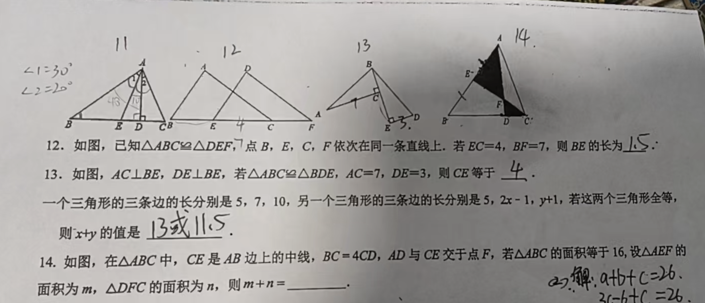
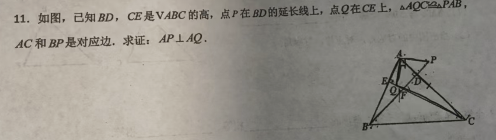

# 错题本

## 2026.09.05

$$
\begin{array}{l}
思路: 用 m和n表示整个图形的面积，找出m和n之间的关系式。\\
连接 BF, 根据三角形同顶角，底边面积公式 \\
\left\{
   \begin{array}{l}
      S_{\triangle AEC} - S_{\triangle ADC} = m - n = 8 - 4 = 4 \ldots (1) \\
      S_{\triangle ABC} = 2m + 3n + n + 4n = 16 = 2m + 8n \ldots (2) \\
   \end{array}
\right. \\
=> 
\left\{
   \begin{array}{l}
      m - n = 4 \\
      m + 4n = 8 
   \end{array}
\right.\\
=> 
\begin{cases}
      n = \frac{4}{5} \\
      m = \frac{24}{5}
\end{cases} \\
=> m + n = \frac{28}{5}
\end{array}
$$

## 2026.09.03

$$
\begin{array}{l}
   \because \triangle AQC \cong \triangle APB, AC = BP \\
   \therefore \angle AQC = \angle PAB (对应边的对应角相等) \ldots (1) \\
   \therefore \angle QCA + \angle QAC = \angle APB + \angle ABP  \ldots (2) \\

   \because \angle ABP + \angle BAC = 90 (BD \perp AC) \ldots (3)\\
   \therefore \angle ABP + \angle BAQ + \angle CAQ = 90 \\
   \because \angle EAQ + \angle EQA = 90 (CE \perp AB) \\
   \therefore \angle EAQ + \angle QCA + \angle CAQ = 90 \\
   代入 (2) \\
   \angle EAQ + \angle APB + \angle ABP = 90 \\
   代入 (3)
   \angle EAQ + \angle APB + 90 - \angle BAC = 90 \\
   \angle EAQ + \angle APB = \angle BAC \\
   \because \angle EAQ + \angle CAQ = \angle BAC \\
   \therefore \angle CAQ = \angle APB \\
   \because \angle APD + \angle PAD = 90 \\
   \therefore \angle CAQ + \angle PAD = 90 \\
   \therefore \angle PAQ = 90  \\
   即  AQ \perp AP
\end{array}
$$